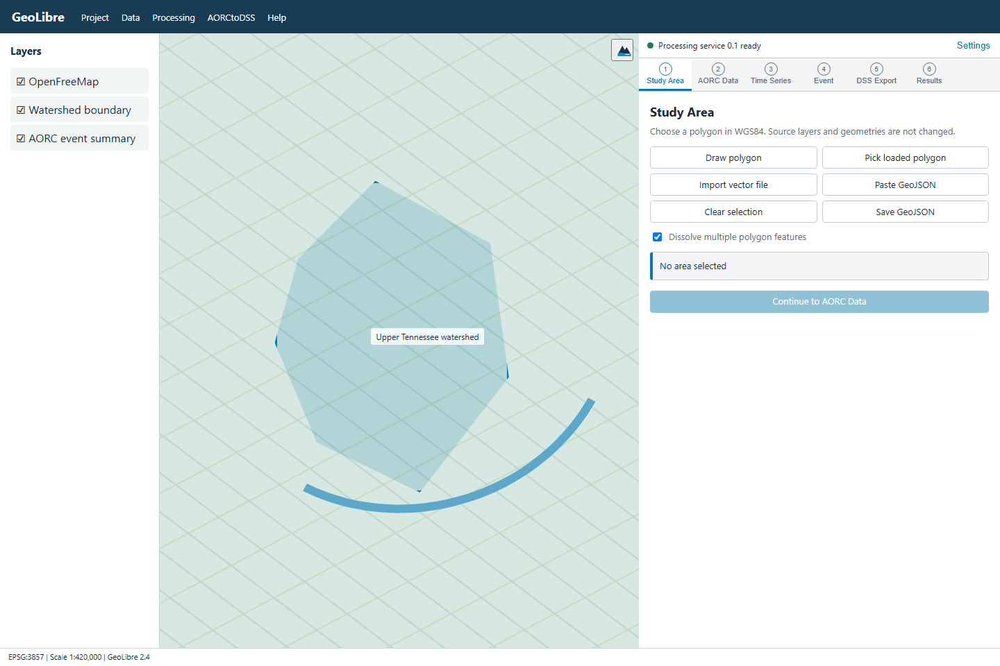

# AORCtoDSS

AORCtoDSS is a GeoLibre plugin for preparing NOAA Analysis of Record for
Calibration data for HEC-HMS and other HEC applications.

The plugin can:

- Read AORC data for a selected polygon and time period
- Calculate a watershed-average time series
- Convert precipitation and temperature to metric or US customary units
- Select and plot an event
- Build a cached event animation in GeoLibre's Time Slider
- Reproject hourly grids to the Standard Hydrologic Grid
- Write HEC-DSS gridded records
- Reopen the DSS file and validate the records
- Create a clipped Cloud-Optimized GeoTIFF for the event summary

The source repository is
[mohsennasab/aorc-to-dss](https://github.com/mohsennasab/aorc-to-dss).



## GeoLibre user guide

### Requirements

The packaged release requires:

- GeoLibre 2.4 or later
- 64-bit Windows 10 or Windows 11
- Internet access to the public NOAA AORC archive

The installed and portable versions of GeoLibre are supported. The plugin and
processing service are installed under the current Windows user profile, so
administrator access is not required.

### Install the packaged release

1. Download the latest Windows release from the
   [GitHub releases page](https://github.com/mohsennasab/aorc-to-dss/releases).
2. Extract the release to a local folder.
3. Right-click `install-windows.ps1` and select **Run with PowerShell**.
4. Wait for the installer to finish.
5. Close GeoLibre if it is open.
6. Start GeoLibre.
7. Open **Plugins** and activate **AORCtoDSS**.

The installer places the files in these locations:

```text
Plugin:  %APPDATA%\org.geolibre.desktop\plugins\aorctodss.zip
Service: %LOCALAPPDATA%\AORCtoDSS\bin\AORCtoDSS-Service.exe
Cache:   %LOCALAPPDATA%\AORCtoDSS\cache
```

It also creates a startup shortcut for the local processing service.

The service may take about 15 seconds to start because the packaged executable
must unpack its runtime files. The plugin waits and reconnects during startup.
A green status dot means the service and HEC-DSS component are ready.

### Install only the GeoLibre plugin

Use this option when the processing service is already installed or is running
from source.

1. Open **Settings > Manage Plugins > Install from file** in GeoLibre.
2. Select `AORCtoDSS-plugin-0.1.6.zip`.
3. Restart GeoLibre.
4. Activate **AORCtoDSS** from the Plugins menu.

### Start the local service by hand

If the service status remains unavailable, run:

```powershell
& "$env:LOCALAPPDATA\AORCtoDSS\bin\AORCtoDSS-Service.exe"
```

The service listens on `http://127.0.0.1:8765`. It accepts requests only from
GeoLibre desktop, GeoLibre web, and local development origins.

### Workflow

The plugin has six steps.

#### Step 1: Study Area

Choose one of the study area methods:

- **Draw polygon** starts the map drawing tool.
- **Pick loaded polygon** captures a polygon from a layer already on the map.
- **Import vector file** reads GeoJSON or geometry decoded by GeoLibre.
- **Save GeoJSON** writes the accepted study area in WGS84.

While drawing, the map shows an orange boundary, a provisional fill, and each
fixed vertex. Use **Undo last vertex** to remove a point. Double-click or select
**Finish polygon** when the shape is complete.

Double-click zoom is disabled while drawing. It is restored when drawing
finishes or the selection is cleared.

Projected GeoJSON is supported when the file contains a CRS declaration such
as `EPSG:5070`. The plugin transforms the analysis copy to WGS84. It does not
change the source file.

Multiple polygon features can be dissolved into one study area. The interface
reports the area, feature count, source CRS, repair status, and analysis CRS.

#### Step 2: AORC Data

The variable list loads when the local service becomes available. Choose:

- An AORC variable
- Metric or US customary units
- A UTC start date and time
- A UTC end date and time

The end time is exclusive for the time-series request.

#### Step 3: Time Series

Choose an averaging method:

- **Area weighted** intersects AORC cells with the polygon in an equal-area
  projection. This is the default.
- **Cell center** gives equal weight to cells whose centers fall inside the
  polygon.

Select **Run analysis** to calculate the watershed-average series.

The chart supports:

- Mouse wheel zoom
- Shift and drag to pan
- Drag to select an event interval
- PNG export with a save dialog
- CSV export

The table is not shown in the plugin. Use **Export CSV** when the values are
needed outside the chart.

#### Step 4: Event Selection

Enter an event start and end time, or choose one of these durations:

- 24 hours
- 48 hours
- 72 hours
- 96 hours

The selected interval is plotted below the event summary. The summary reports
the number of hourly grids, UTC period, units, and selected-series statistic.

For hourly precipitation, an event from `00:00` through `03:00` uses the grids
ending at `01:00`, `02:00`, and `03:00`.

##### Create the Time Slider animation

The animation does not start when an event is selected.

Select **Download frames and create Time Slider** when the event is ready. The
progress bar reports three parts of the work:

1. Reading the selected AORC window from NOAA
2. Creating clipped hourly COG frames
3. Loading the frames into GeoLibre's browser cache

The Time Slider opens below the map after all frames are ready. Playback then
uses the local cache and does not wait for NOAA downloads.

Animation frames:

- Use WGS84 coordinates
- Are clipped to the study polygon
- Treat zero precipitation and NoData as transparent
- Use a radar-style color scale
- Progress from blue and green through yellow and red
- Use magenta and pink for the highest precipitation

The first download takes longer for a large study area or a 96-hour event.
Cached frames remain under `%LOCALAPPDATA%\AORCtoDSS\cache\animations`.

#### Step 5: DSS Export

Choose:

- Output folder
- DSS filename
- Watershed or project name
- SHG cell size
- Optional AOI buffer
- Overwrite behavior

Supported SHG cell sizes are:

```text
10, 20, 50, 100, 200, 500, 1000, 2000, 4000, 5000, and 10000 m
```

The default is 2000 m.

Select **Estimate size** to review the grid dimensions, record count, and
estimated storage. Select **Create DSS and validate** to run the export.

The export reads the selected event from NOAA, converts the values, reprojects
each hourly grid, writes the DSS records, and reads them back for validation.

#### Step 6: Results

Review the validation status before using the DSS file in a model.

The checks include:

- DSS reopen
- Expected pathnames
- Record count
- Hourly continuity
- Event boundaries
- Units and data type
- SHG dimensions and cell indices
- SHG projection metadata
- Non-null grids
- Reprojection and DSS read-back differences

A warning is not the same as a failed write. Review the finding and processing
log to decide whether the result is acceptable for the model.

The event summary COG is added to the map with:

- EPSG:5070 SHG coordinates
- Polygon clipping
- A precipitation color ramp
- Transparent zero and NoData pixels

### Units

The unit-system selection applies to the time series, event statistic, COG,
animation frames, and DSS grids.

| Variable | AORC units | Metric output | US customary output |
| --- | --- | --- | --- |
| Total precipitation | kg/m^2 | mm | in |
| Air temperature at 2 m | K | degrees C | degrees F |
| Specific humidity | kg/kg | kg/kg | kg/kg |
| Radiation flux | W/m^2 | W/m^2 | W/m^2 |
| Surface pressure | Pa | Pa | Pa |
| Wind components | m/s | m/s | m/s |

For water depth, `1 kg/m^2` is equal to `1 mm`.

The temporary event Zarr cache keeps the original AORC values. Converted
values are used for the displayed series and exported products.

### DSS pathname format

Gridded records use:

```text
/A-PART/B-PART/C-PART/D-PART/E-PART/F-PART/
```

Example:

```text
/SHG/UPPER TENNESSEE/PRECIP/26OCT2025:2300/27OCT2025:0000/AORC-V1.1/
```

| Part | Meaning |
| --- | --- |
| A | SHG system and resolution |
| B | Watershed or project |
| C | Meteorologic parameter |
| D | Interval start |
| E | Interval end |
| F | Dataset and version |

An interval ending at midnight uses the preceding date with `2400` when that
notation is required by HEC-DSS.

### Output files

An event export can create:

- HEC-DSS file
- Watershed-average CSV
- Watershed-average Parquet file
- Study area GeoPackage
- Event summary JSON
- Download log
- Processing log
- DSS pathname inventory
- Grid metadata
- Validation report
- Event-total or event-mean COG
- Temporary event Zarr processing cache

The Time Slider frames use a separate cache under the local service directory.

### Troubleshooting

#### Local processing service is starting or reconnecting

Wait up to 30 seconds after installation or Windows sign-in. If the status does
not recover, start the service by hand:

```powershell
& "$env:LOCALAPPDATA\AORCtoDSS\bin\AORCtoDSS-Service.exe"
```

You can check the service in a browser:

```text
http://127.0.0.1:8765/health
```

#### Variables do not load

Confirm that the service status is green. Check access to:

```text
https://noaa-nws-aorc-v1-1-1km.s3.amazonaws.com
```

NOAA may be updating an annual store. Wait and retry before changing the
project.

#### The Time Slider is not created

Confirm that an event is selected, then use **Download frames and create Time
Slider**. Wait for the progress bar to reach 100 percent.

If the service restarted during the download, select the button again.

#### A dry animation frame is blank

This is expected when the precipitation grid contains only zeros. Zero
precipitation is transparent.

#### No SHG cells intersect the polygon

Choose a smaller SHG cell size. A coarse grid can leave no cell centers inside
a small polygon.

#### An output file already exists

Choose another folder or filename. Select overwrite only when the existing
output is no longer needed.

#### HEC-HMS does not recognize the grid

Confirm that the basin grid-cell file uses the same SHG resolution. Review the
pathname A-part, grid metadata, and validation report.

## Developer guide

### Clone the repository

```powershell
git clone https://github.com/mohsennasab/aorc-to-dss.git
Set-Location aorc-to-dss
```

### Development requirements

- Node.js 22 or later
- Python 3.11 or later
- GeoLibre 2.4 or later
- Windows for the packaged service and installer

The browser plugin can be developed on another operating system. The packaged
HEC-DSS service should be built and tested on Windows.

### Install dependencies

```powershell
npm install
python -m pip install -e ".[dev,packaging]"
```

### Run from source

Start the processing service:

```powershell
python -m aorctodss_service
```

Build the GeoLibre plugin:

```powershell
npm run build
```

Create the plugin archive:

```powershell
npm run package:plugin
```

Install the generated archive from GeoLibre:

```text
Settings > Manage Plugins > Install from file
```

Select the current ZIP file under `release`.

### Project structure

```text
src/
  api/                  Browser client for the local service
  core/                 Geometry, time, and pathname helpers
  ui/                   Workbench, chart, and map drawing tools
  plugin.ts             GeoLibre plugin entry point

service/aorctodss_service/
  aorc/                 Archive catalog, subsets, and watershed averages
  dss/                  Pathnames, HEC-DSS adapter, and validation
  events/               UTC event calculations
  spatial/              Geometry, SHG, reprojection, weights, and COG output
  animation.py          Animation registration and frame preloading
  jobs.py               Background processing jobs
  pipeline.py           Event export workflow
  server.py             Loopback HTTP service

tests/
  Python and TypeScript tests

scripts/
  Build, package, install, and packaged-service checks
```

The browser plugin does not write HEC-DSS files. It sends requests to the
loopback service. The service owns NOAA reads, raster processing, native
HEC-DSS calls, output files, and animation caches.

### Run the tests

Run the Python tests:

```powershell
python -m pytest
```

Run TypeScript type checking, tests, and the production build:

```powershell
npm run check
```

The standard Python suite does not access NOAA. Live archive tests are marked
as integration tests.

Run the live tests:

```powershell
$env:AORCTODSS_RUN_INTEGRATION = "1"
python -m pytest -m integration
Remove-Item Env:AORCTODSS_RUN_INTEGRATION
```

Live tests read a small public AORC window. They check archive metadata, annual
store boundaries, DSS output, and animation frame preloading.

### Build the Windows release

Build the service:

```powershell
.\scripts\build-service.ps1
```

Build the plugin and copy the release files:

```powershell
.\scripts\build-release.ps1
```

Test the packaged service:

```powershell
.\scripts\test-packaged-service.ps1
```

The packaged-service check verifies:

- Service startup
- HEC-DSS dependency loading
- SHG grid write and read-back
- Loopback health response
- Grid estimate response

Release files are written under `release`. The directory is ignored by Git.
Upload release files through a GitHub release instead of adding them to source
control.

### Version updates

Keep the version in sync across:

- `package.json`
- `package-lock.json`
- `pyproject.toml`
- `geolibre-plugin/plugin.json`
- `src/plugin.ts`
- `service/aorctodss_service/__init__.py`
- `service/aorctodss_service/server.py`
- `service/aorctodss_service/aorc/catalog.py`

Add the release notes to `CHANGELOG.md`.

### Release checklist

1. Update the version files and changelog.
2. Run `python -m pytest`.
3. Run `npm run check`.
4. Run the live integration tests.
5. Build the service on Windows.
6. Run the packaged-service check.
7. Install the release into a clean GeoLibre profile.
8. Run a short precipitation event.
9. Create and play the Time Slider animation.
10. Open the DSS file in HEC-DSSVue or HEC-HMS.
11. Review the DSS validation report.
12. Inspect the plugin archive contents.
13. Review Git status before committing.

### Repository and packaging privacy

The `private` directory, runtime data, release files, caches, local notes, and
working files are excluded by `.gitignore`.

Before each commit, run:

```powershell
git status --short
git check-ignore -v private/
git ls-files private
git diff --cached --check
```

`git ls-files private` should return no output.

The plugin packaging script rejects private paths, working notes, handoff
files, memory files, and Markdown files. Inspect the archive before publishing:

```powershell
npm run package:plugin
tar -tf .\release\AORCtoDSS-plugin-0.1.6.zip
```

The plugin archive should contain:

- `plugin.json`
- `icons/aorctodss.svg`
- `dist/index.js`
- `dist/index.js.map`
- `dist/style.css`

Do not place project data, output files, local paths, credentials, or private
documents in examples, tests, screenshots, logs, or release notes.

More implementation notes are available in
[docs/development.md](docs/development.md).

## Known limitations

- SHG output is limited to CONUS.
- The packaged service is built for Windows.
- Linux and macOS can run the service from source where the official HEC
  library is available.
- Source-to-projected mean comparison is a screening check. It is not a
  conservative remapping proof for every boundary shape.
- NOAA may regenerate an annual AORC store. Record the access date for
  production work.

## License and attribution

AORCtoDSS is licensed under the MIT License.

The packaged service uses the official USACE HEC-DSS source and Python wrapper.
Their license notices remain in the release materials.

NOAA AORC data are distributed through the NOAA Open Data Dissemination
program. Cite the dataset as:

> NOAA Analysis of Record for Calibration (AORC) Dataset, accessed on the run
> date from https://registry.opendata.aws/noaa-nws-aorc/

Output rasters are transformed products and should not be described as
unaltered NOAA data.

References:

- [GeoLibre](https://geolibre.app/)
- [GeoLibre plugin development](https://plugins.geolibre.app/develop/)
- [NOAA AORC registry](https://registry.opendata.aws/noaa-nws-aorc/)
- [HEC-DSS source](https://github.com/HydrologicEngineeringCenter/hec-dss)
- [HEC-DSS Python wrapper](https://github.com/HydrologicEngineeringCenter/hec-dss-python)
- [HEC-DSS documentation](https://www.hec.usace.army.mil/confluence/dssdocs/)
